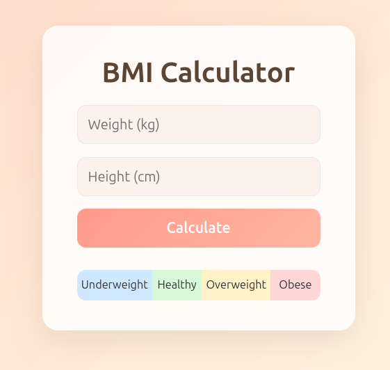

# BMI Calculator

A simple BMI (Body Mass Index) calculator in vanilla JS.

### Tech Used

- HTML
- CSS
- JavaScript

### Features

- BMI calculation
- User input fields
- Input validation
- BMI result display
- Health category classification
- Visual BMI scale indicator
- Dynamic highlighting
- Clean UI

### BMI Categories

- Underweight: BMI < 18.5
- Healthy: 18.5 ≤ BMI < 25
- Overweight: 25 ≤ BMI < 30
- Obese: BMI ≥ 30

### Screenshots

